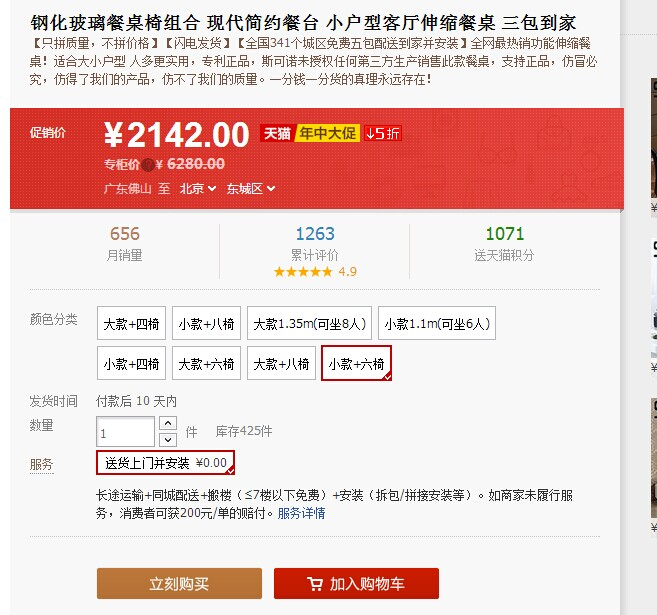
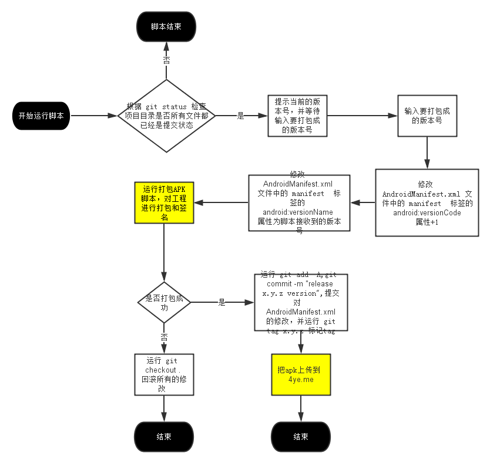
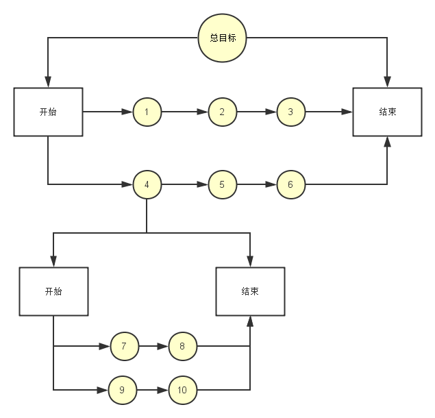

# Bootstrap Image Gallery

图片展示组件

## 网址 
https://github.com/blueimp/Bootstrap-Image-Gallery

## 前段代码

HTML
```html
    <!-- The Bootstrap Image Gallery lightbox, should be a child element of the document body -->
    <div id="blueimp-gallery" class="blueimp-gallery">
        <!-- The container for the modal slides -->
        <div class="slides"></div>
        <!-- Controls for the borderless lightbox -->
        <h3 class="title"></h3>
        <a class="prev">‹</a>
        <a class="next">›</a>
        <a class="close">×</a>
        <a class="play-pause"></a>
        <ol class="indicator"></ol>
        <!-- The modal dialog, which will be used to wrap the lightbox content -->
        <div class="modal fade">
            <div class="modal-dialog">
                <div class="modal-content">
                    <div class="modal-header">
                        <button type="button" class="close" aria-hidden="true">&times;</button>
                        <h4 class="modal-title"></h4>
                    </div>
                    <div class="modal-body next"></div>
                    <div class="modal-footer">
                        <button type="button" class="btn btn-default pull-left prev">
                            <i class="glyphicon glyphicon-chevron-left"></i>
                            Previous
                        </button>
                        <button type="button" class="btn btn-primary next">
                            Next
                            <i class="glyphicon glyphicon-chevron-right"></i>
                        </button>
                    </div>
                </div>
            </div>
        </div>
    </div>

    <!-- 要展示的图片 -->
    <div id="links">
        <a href="images/1.png" title="1" data-gallery>
            
        </a>
        <a href="images/2.png" title="2" data-gallery>
            
        </a>
        <a href="images/3.png" title="3" data-gallery>
            
        </a>
        <a href="images/4.png" title="4" data-gallery>
            
        </a>
    </div>

```

## 页面效果

